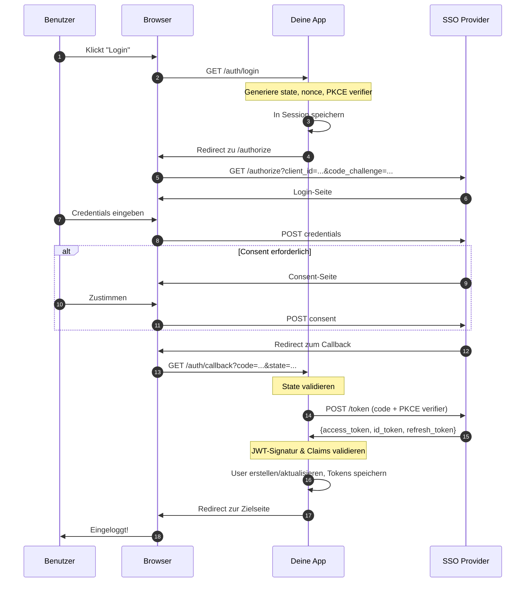
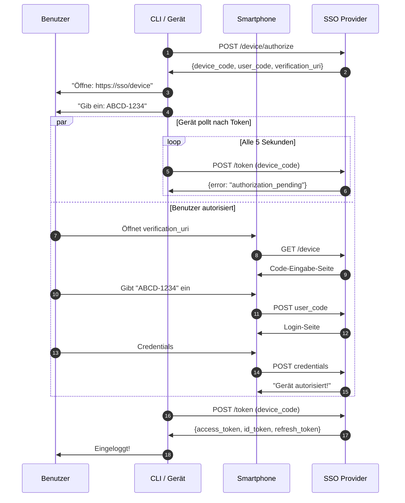
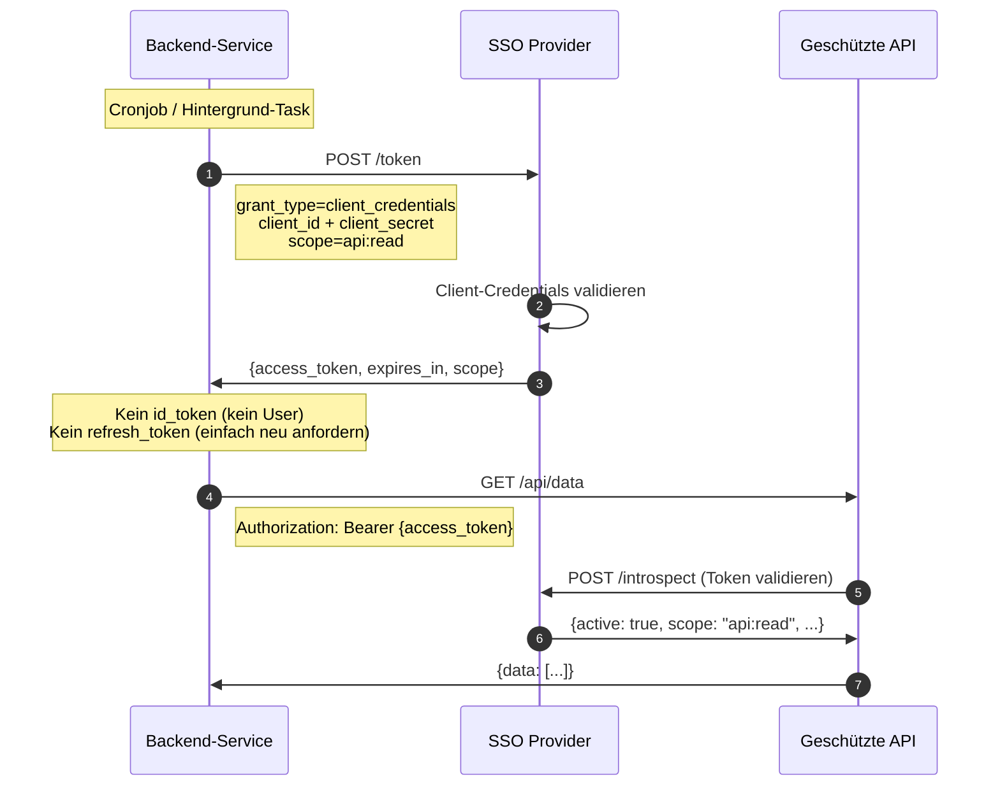
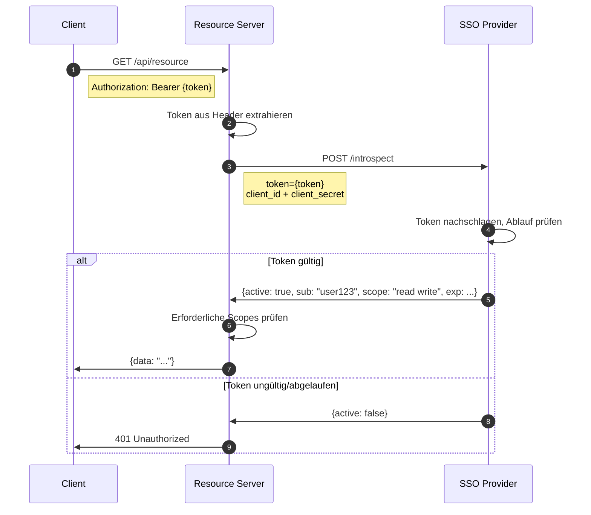
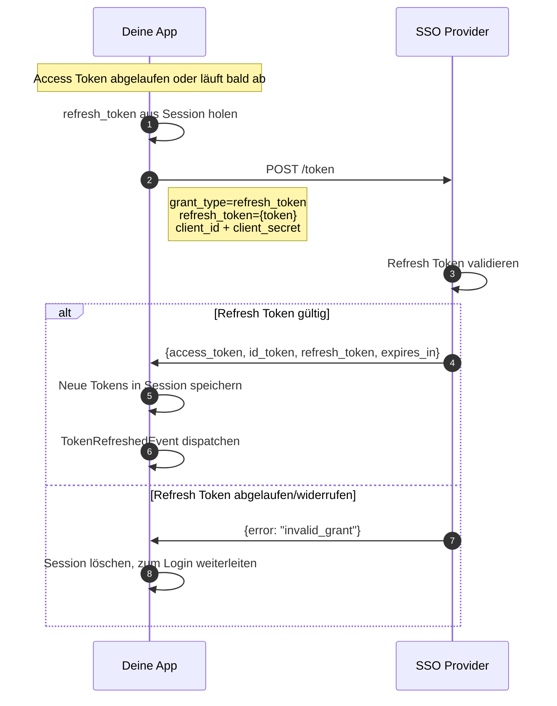
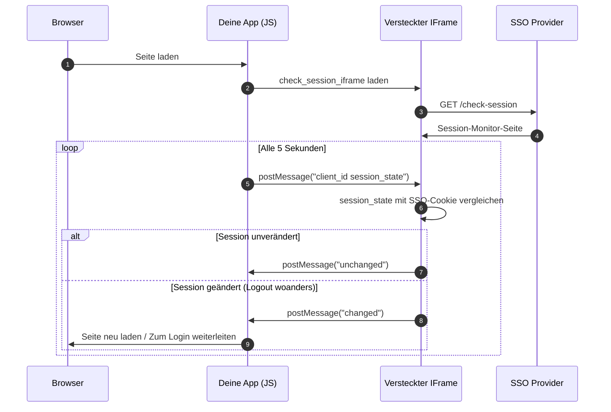
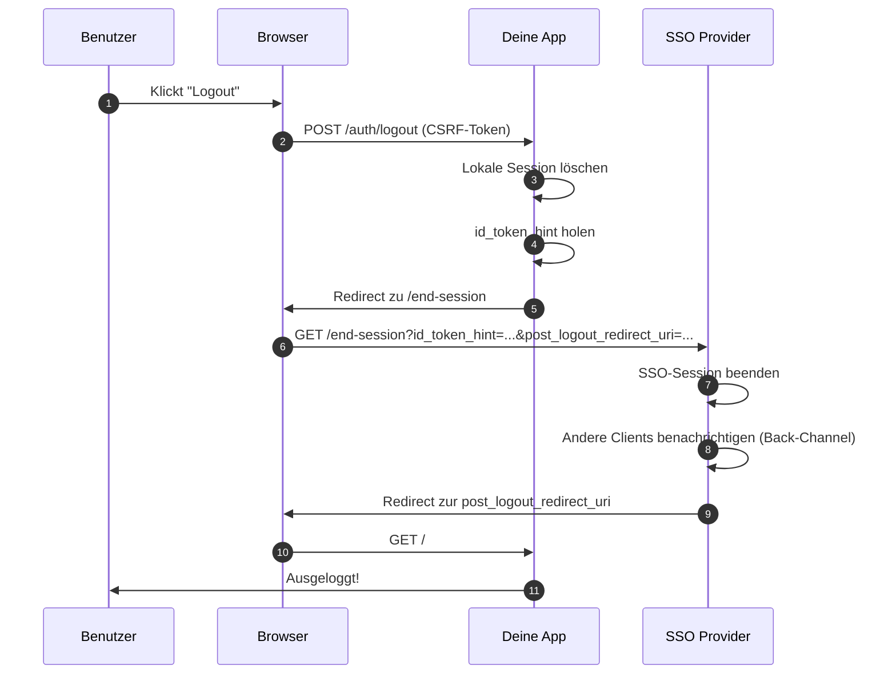
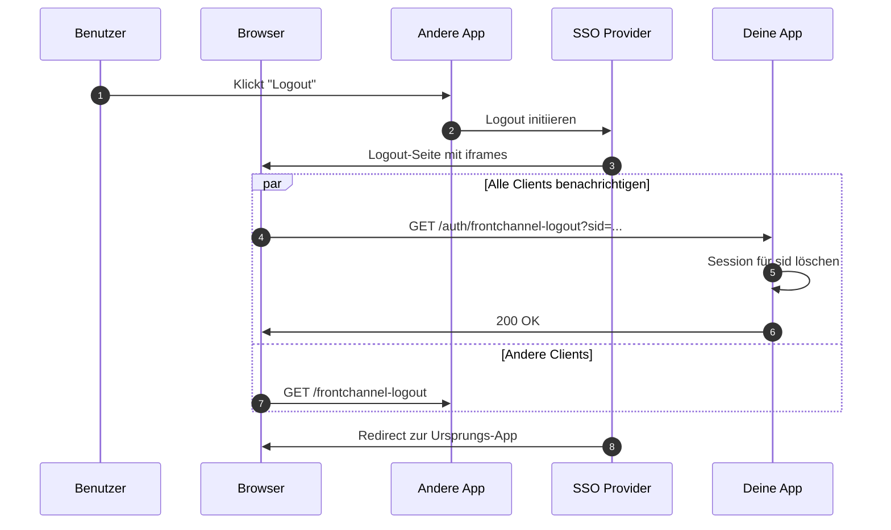
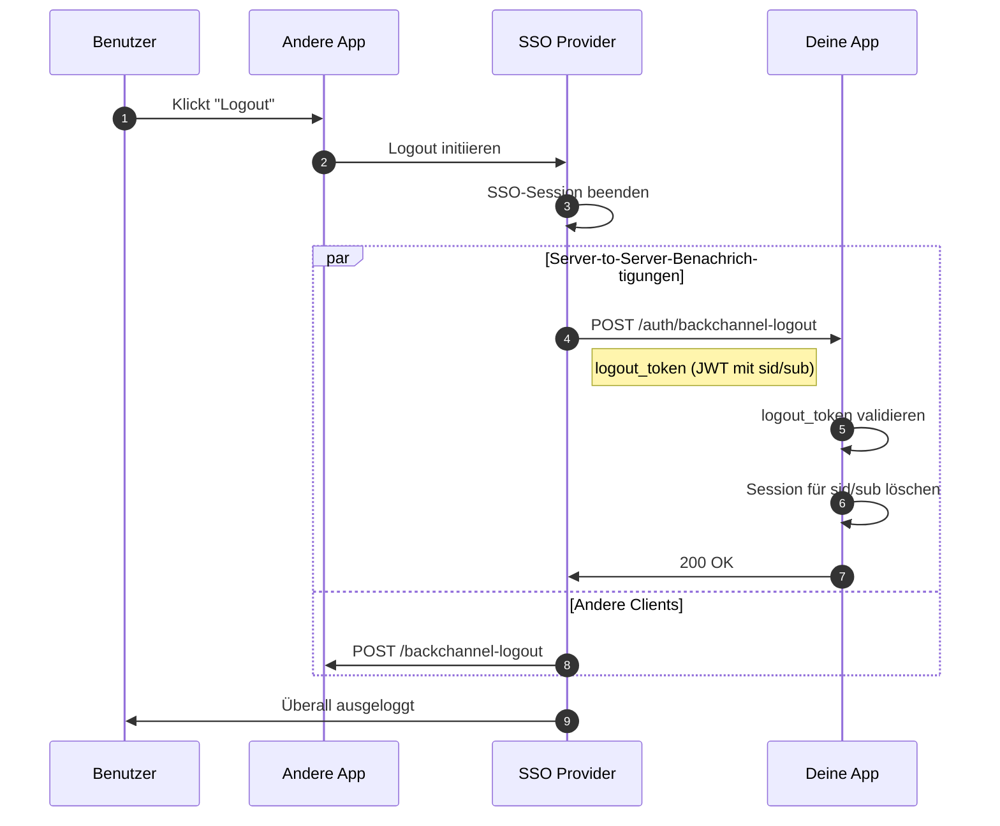
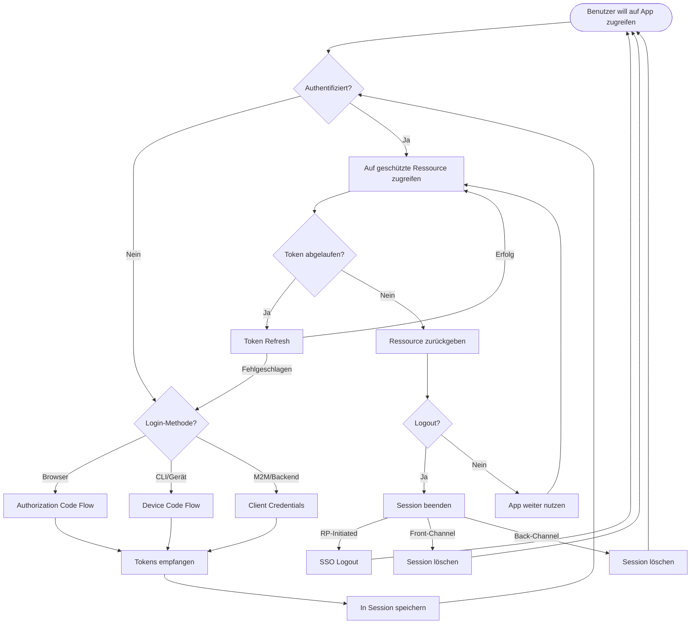

# OIDC Flow-Diagramme

Visuelle Sequenzdiagramme für alle unterstützten Authentifizierungs-Flows.

## Authorization Code Flow (mit PKCE)

Der Standard-Login-Flow für Browser.

## Device Authorization Grant (RFC 8628)

Für Geräte ohne Browser (CLI, Smart TV, IoT).

## Client Credentials Grant (M2M)

Für Machine-to-Machine-Kommunikation ohne Benutzerinteraktion.

## Token Introspection (RFC 7662)

Für Resource Server, die eingehende Tokens validieren.

## Token Refresh

Stille Token-Erneuerung mit Refresh Token.

## Session Management

SSO-Session-Änderungen erkennen (z.B. Logout in anderer App).

## Logout-Flows

### RP-Initiated Logout

Benutzer klickt Logout in deiner App.

### Front-Channel Logout

SSO benachrichtigt deine App via versteckte iframes.

### Back-Channel Logout

SSO benachrichtigt deine App via Server-to-Server HTTP.

## Komplette Flow-Übersicht

