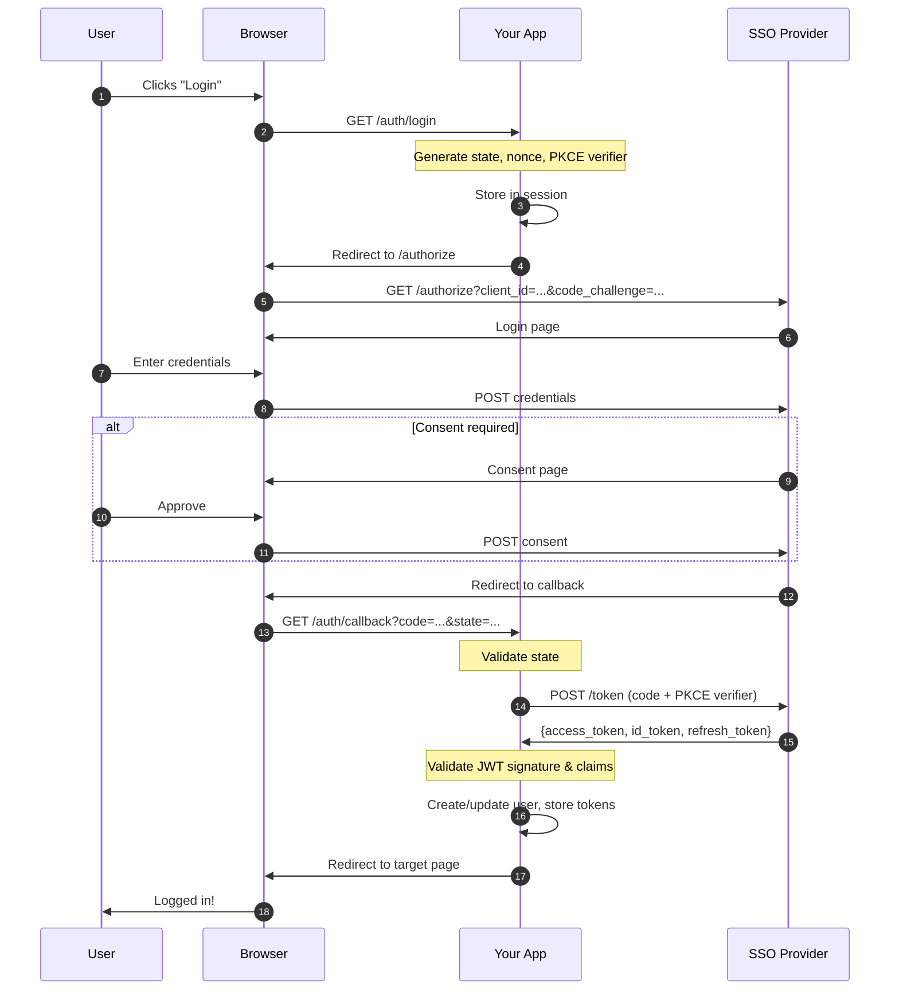
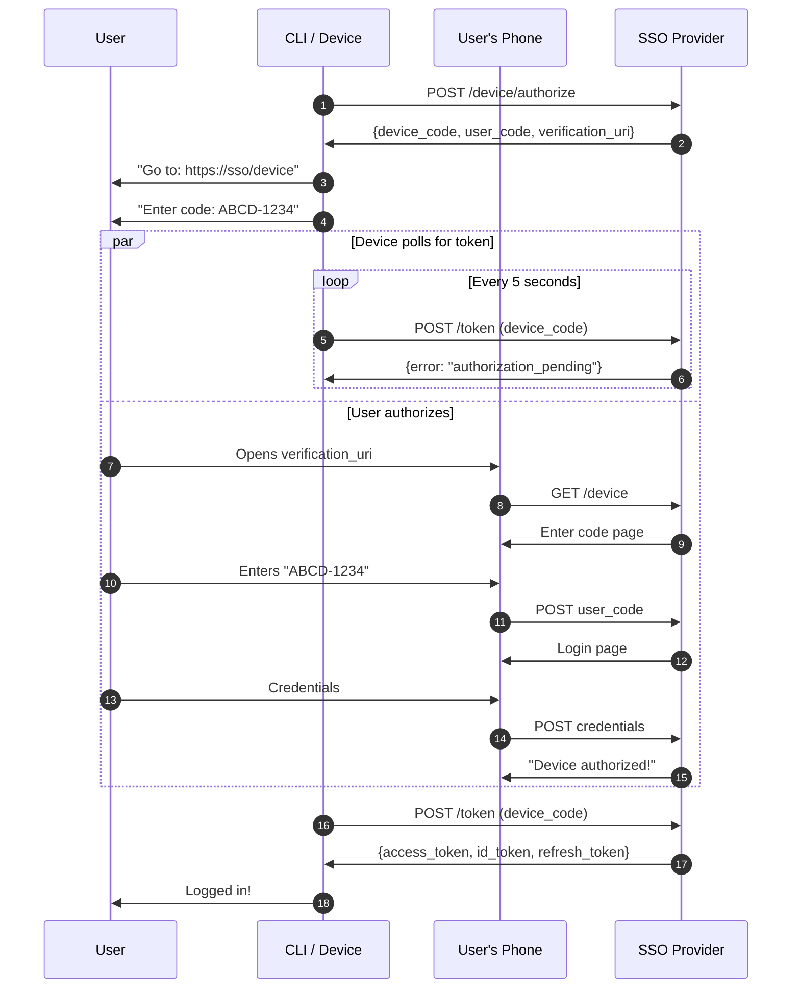
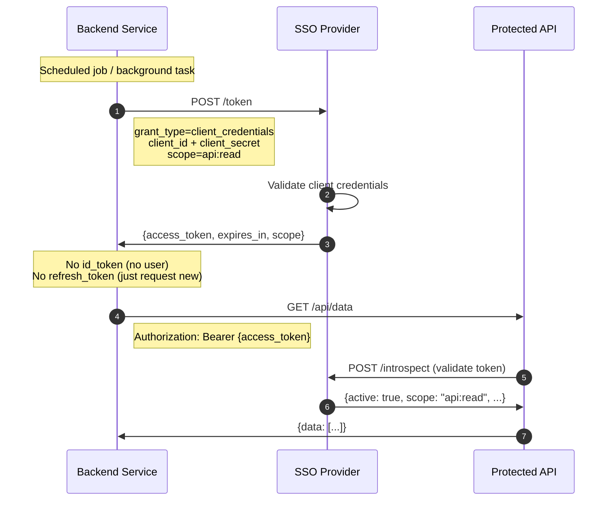
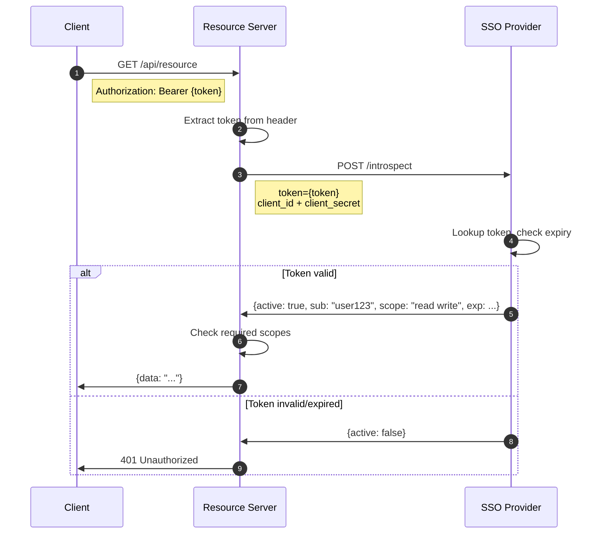
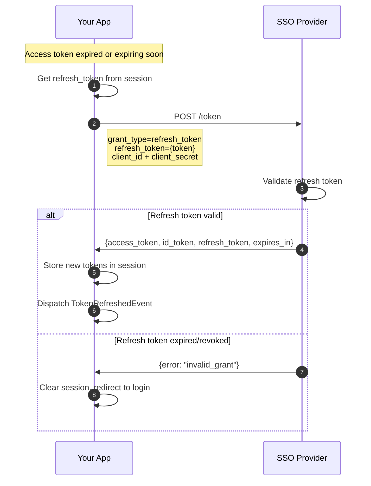
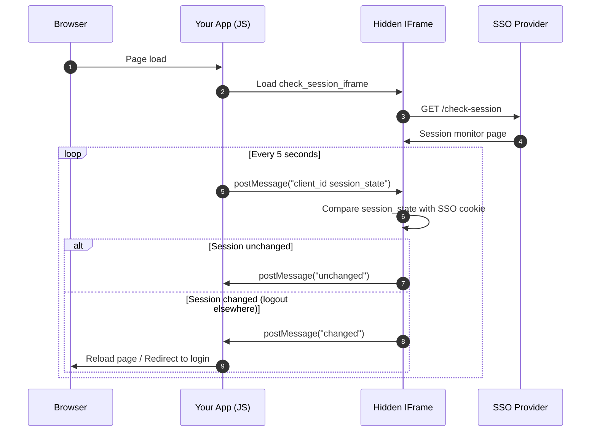
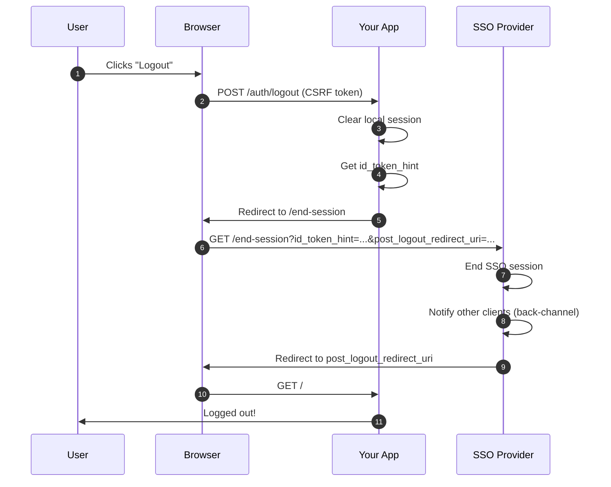
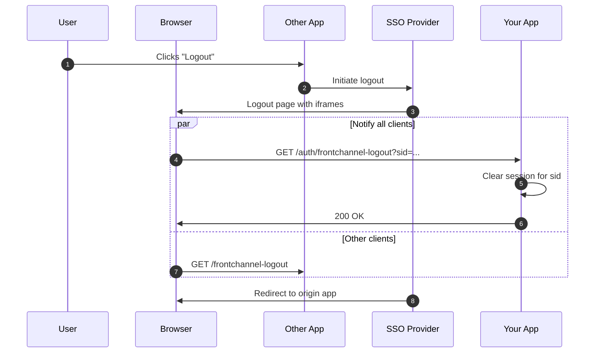
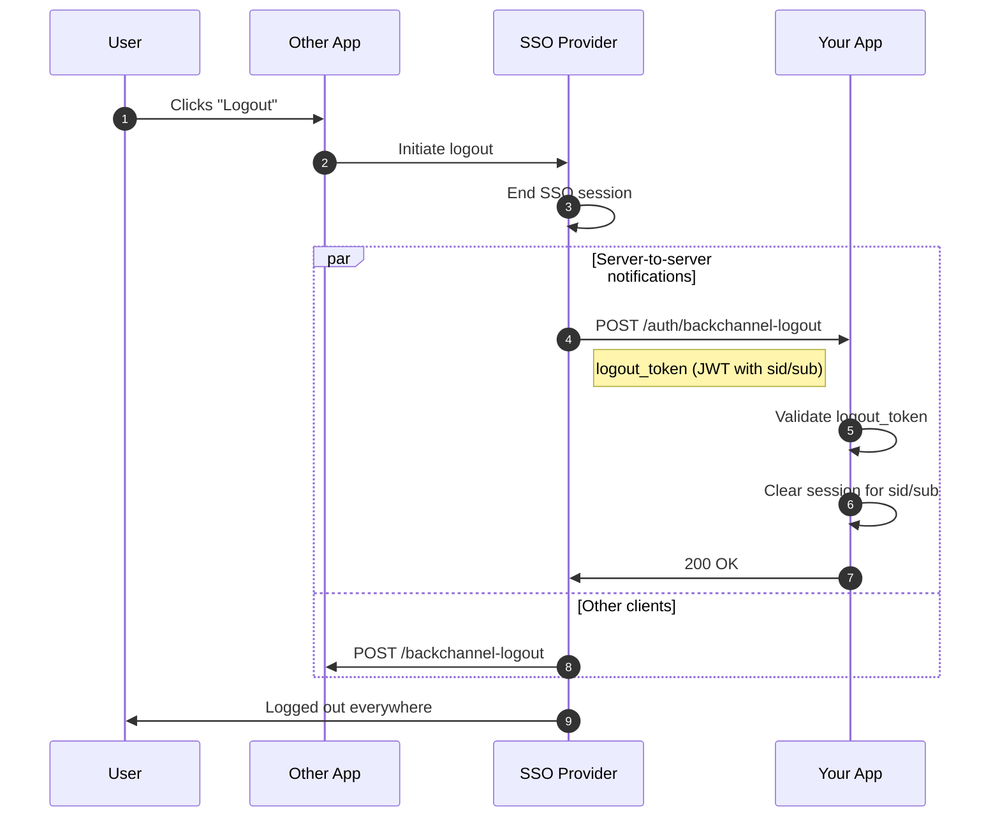
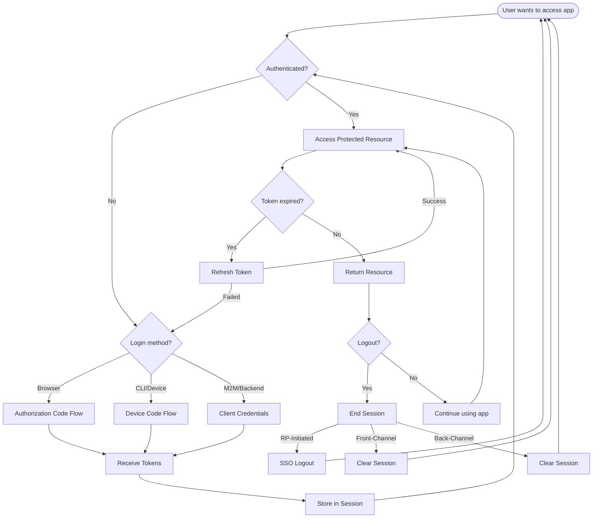

# OIDC Flow Diagrams

Visual sequence diagrams for all supported authentication flows.

## Authorization Code Flow (with PKCE)

The standard browser-based login flow.

## Device Authorization Grant (RFC 8628)

For devices without browser (CLI, Smart TV, IoT).

## Client Credentials Grant (M2M)

For machine-to-machine communication without user interaction.

## Token Introspection (RFC 7662)

For resource servers to validate incoming tokens.

## Token Refresh

Silent token renewal using refresh token.

## Session Management

Detecting SSO session changes (e.g., logout in another app).

## Logout Flows

### RP-Initiated Logout

User clicks logout in your app.

### Front-Channel Logout

SSO notifies your app via hidden iframes.

### Back-Channel Logout

SSO notifies your app via server-to-server HTTP.

## Complete Flow Overview

