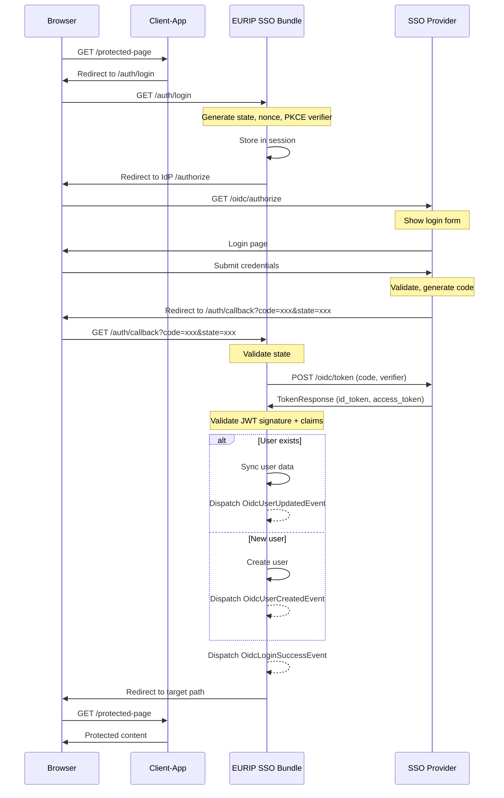
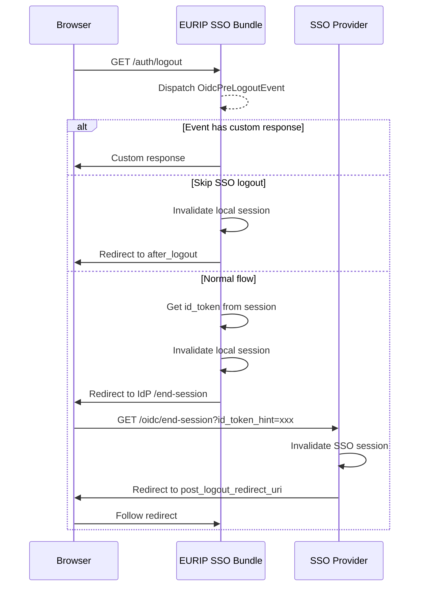
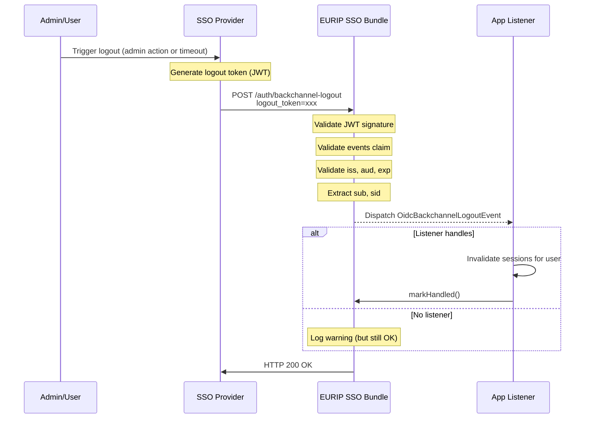
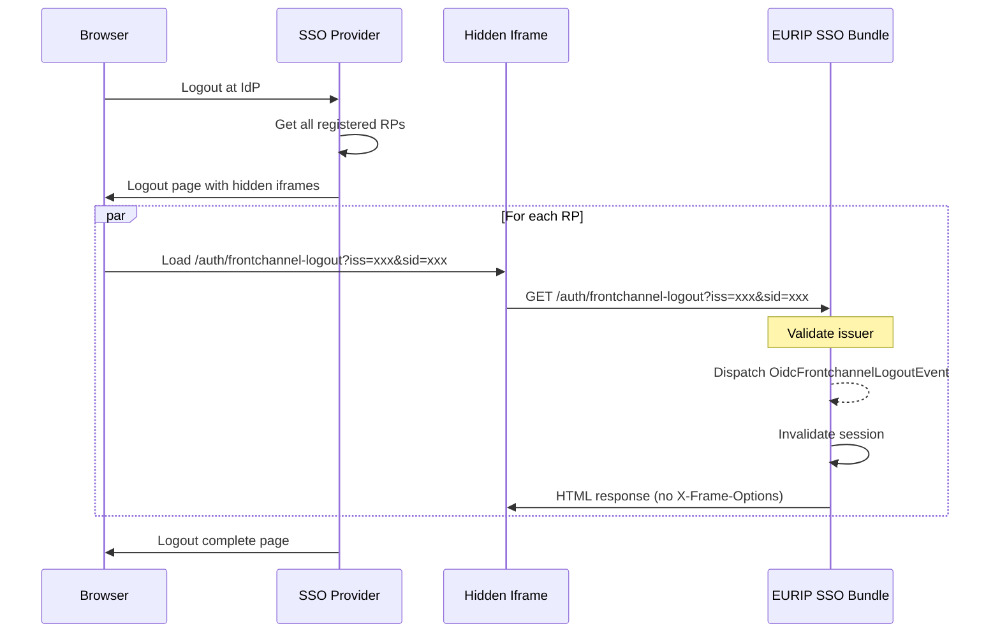
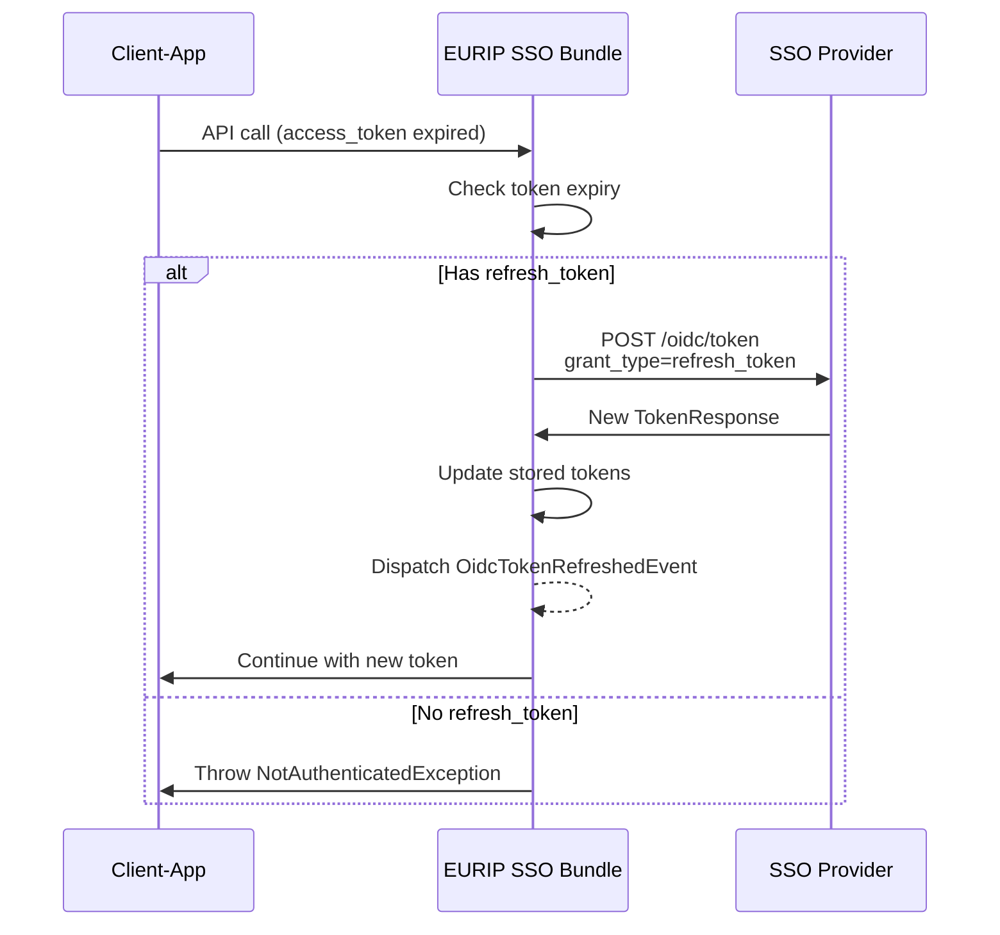
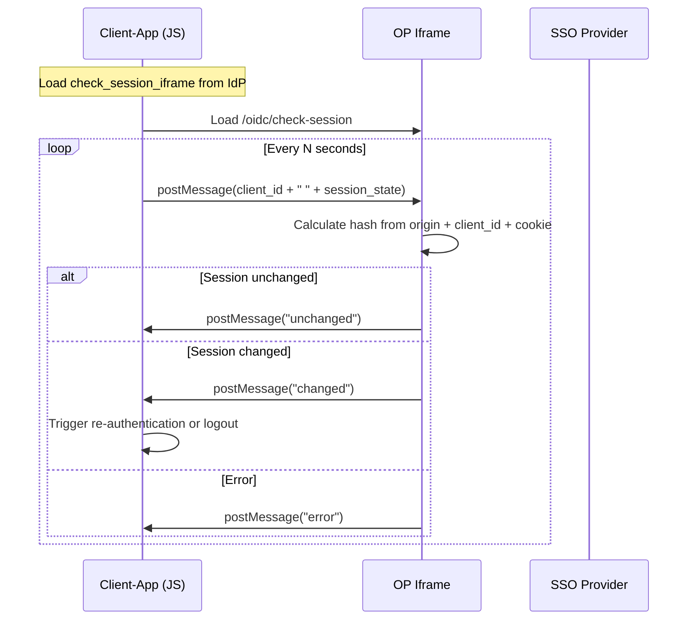

# Sequenzdiagramme - OIDC Flows

DE: Visualisierung der OIDC-Flows im Bundle.
EN: Visualization of OIDC flows in the bundle.

---

## 1. Authorization Code Flow mit PKCE

DE: Standard-Login-Flow (OpenID Connect Core 1.0 + PKCE).
EN: Standard login flow (OpenID Connect Core 1.0 + PKCE).

---

## 2. Logout Flow (RP-Initiated)

DE: Logout vom Client initiiert (OpenID Connect RP-Initiated Logout 1.0).
EN: Logout initiated from client (OpenID Connect RP-Initiated Logout 1.0).

---

## 3. Back-Channel Logout

DE: Server-zu-Server Logout (OpenID Connect Back-Channel Logout 1.0).
EN: Server-to-server logout (OpenID Connect Back-Channel Logout 1.0).

---

## 4. Front-Channel Logout

DE: Browser-basierter Logout via Iframe (OpenID Connect Front-Channel Logout 1.0).
EN: Browser-based logout via iframe (OpenID Connect Front-Channel Logout 1.0).

---

## 5. Token Refresh Flow

DE: Access Token erneuern mit Refresh Token.
EN: Renew access token using refresh token.

---

## 6. Session Management (Check Session)

DE: Browser prüft Session-Status via Iframe (OpenID Connect Session Management 1.0).
EN: Browser checks session status via iframe (OpenID Connect Session Management 1.0).

---

## Event-Flow Übersicht

DE: Zusammenfassung aller Events im Bundle.
EN: Summary of all events in the bundle.

```mermaid
flowchart TD
    subgraph Login
        A[GET /auth/login] --> B[OidcPreLoginEvent]
        B --> C{Custom Response?}
        C -->|Yes| D[Return Response]
        C -->|No| E[Redirect to IdP]
        E --> F[GET /auth/callback]
        F --> G{User exists?}
        G -->|No| H[OidcUserCreatedEvent]
        G -->|Yes| I[OidcUserUpdatedEvent]
        H --> J[OidcLoginSuccessEvent]
        I --> J
        J --> K{Custom Response?}
        K -->|Yes| D
        K -->|No| L[Redirect to target]
    end

    subgraph Logout
        M[GET /auth/logout] --> N[OidcPreLogoutEvent]
        N --> O{Skip SSO?}
        O -->|Yes| P[Local logout only]
        O -->|No| Q[SSO logout]
    end

    subgraph "Server Logout"
        R[POST /backchannel-logout] --> S[OidcBackchannelLogoutEvent]
        T[GET /frontchannel-logout] --> U[OidcFrontchannelLogoutEvent]
    end

    subgraph "Token Refresh"
        V[Token expired] --> W[Refresh token]
        W --> X[OidcTokenRefreshedEvent]
    end
```

---

## Legende

| Symbol | Bedeutung |
|--------|-----------|
| `-->>` | Event dispatch (async) |
| `-->` | Synchroner Aufruf |
| `Note` | Wichtige Verarbeitung |
| `alt/else` | Bedingte Verzweigung |
| `par` | Parallele Ausführung |
| `loop` | Wiederholung |
